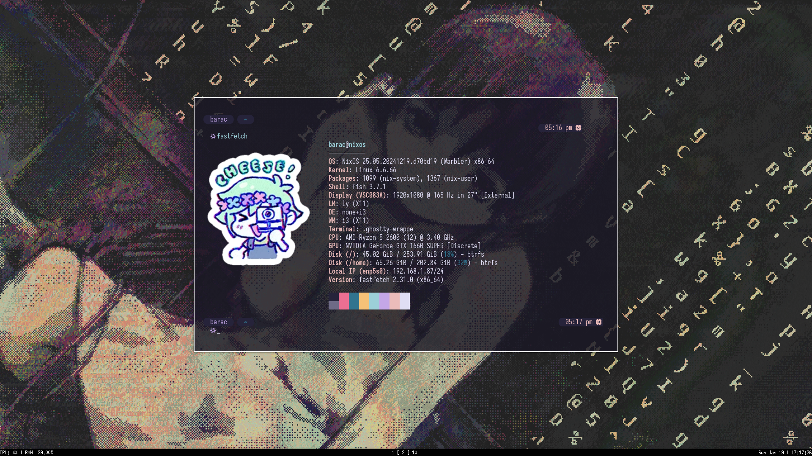
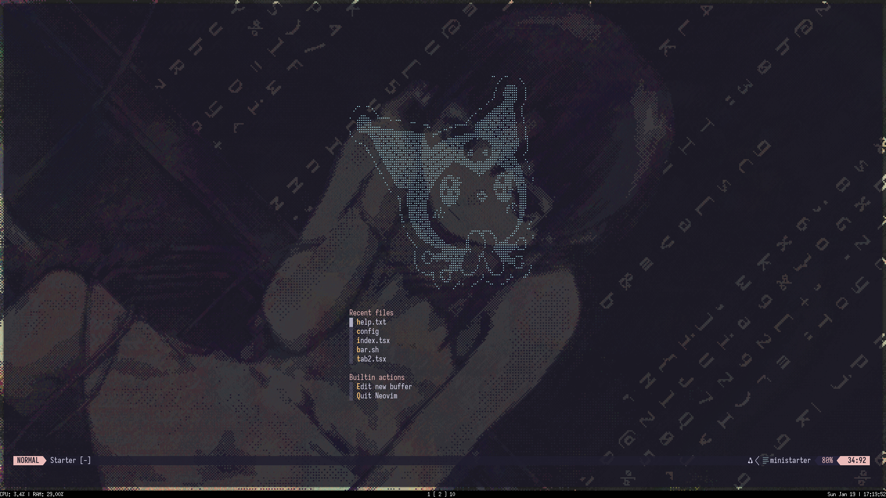

<h1 align="center"> ✿ My Workflow Dotfiles  ✿ </h1>

  

<h2> Neovim </h2>

My neovim config currently is running with nix, check my <a href="https://github.com/calmestend/nix">nix dotfiles</a>

    

<h2> 🛠 </h2>
<ul>
  <li>Neovim</li>
  <li>Tmux</li>
  <li>Yazi</li>
  <li>i3</li>
  <li>Picom</li>
  <li>Ghostty | Alacritty | Wezterm</li>
  <li>Nitrogen</li>
  <li>Starship</li>
</ul>
